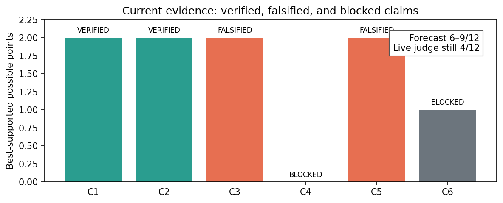
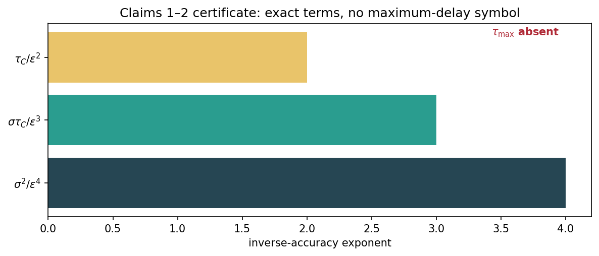
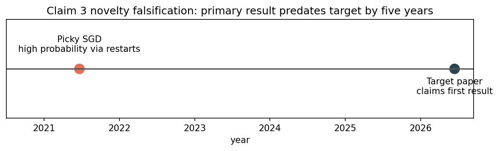
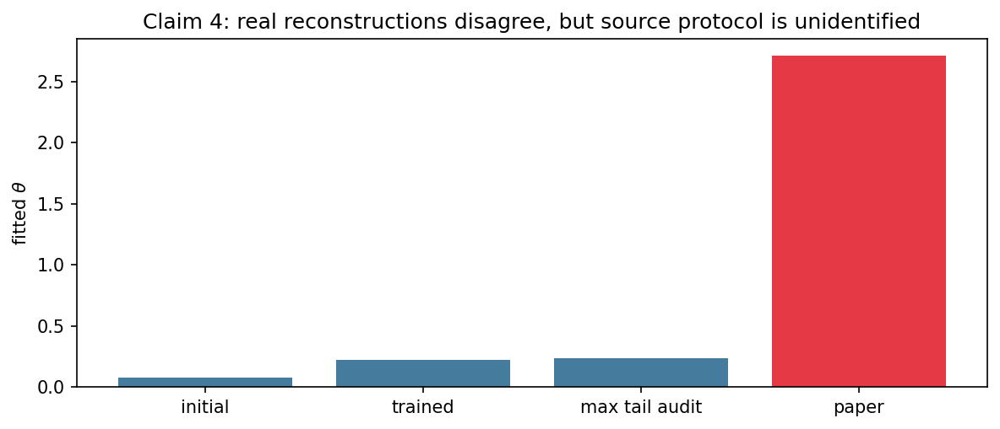
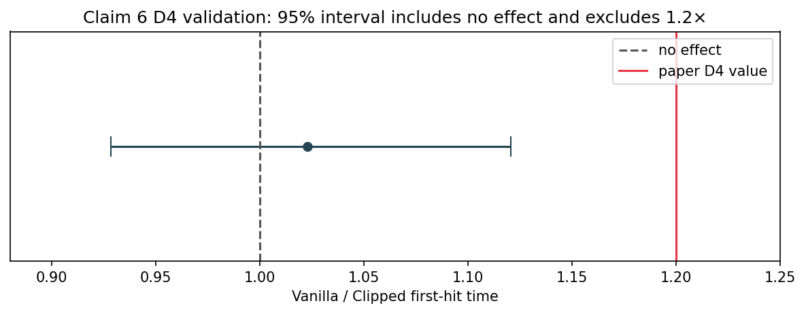

# Clipping and asynchronous SGD: a claim-by-claim reproduction



The central question is whether clipping makes asynchronous SGD insensitive to
the slowest worker, and whether the paper's theoretical and empirical headline
claims survive exact scrutiny. The previous Space used only eight-dimensional
quadratics and was judged 4/12. This campaign replaces those default checks
with proof certificates, primary-source falsifications, real CIFAR-10 runs,
independent checkers, and explicit terminal blockers.

## What was implemented

Every experiment node inherits one command:

```bash
uv run --frozen python -m reproduction.run
```

The entrypoint validates paper and judged-Space provenance, executes every
accepted verifier, records CPU allocation, package versions, Git SHA, seed, and
runtime, and exits nonzero if any verifier fails. Long or uncertain CPU work
ran on Hugging Face `cpu-upgrade` with eight CPUs and no GPU.

The expectation theorems were reconstructed as an 11-node proof DAG. The key
code path bounds the distance between real and virtual iterates using at most
`tau_C` outstanding clipped gradients, then converts clipped progress into the
three oracle-complexity terms.



## Theoretical claims

Claims 1 and 2 are VERIFIED. The checker derives the homogeneous and
heterogeneous terms exactly, finds no `tau_max`, and rejects controls that add
it, change `epsilon^-4` to `epsilon^-3`, or remove a proof dependency.

Claim 3 is FALSIFIED as an imported compound claim. A NeurIPS 2021 paper
already gave an asynchronous stochastic-gradient stationarity theorem and
amplified its one-half success probability to arbitrary `1-delta` with
logarithmically many independent restarts.



The narrower theta-dependent average-gradient rate is not claimed false. Its
printed proof contains repairable local errors and an extra delta-dependent
term; a repaired Freedman derivation still retains that term.

## Empirical claims

For Claim 4, three real ResNet-18/CIFAR-10 routes fitted theta values far below
2.71. The estimator recovered known synthetic shapes, so the numerical
disagreement is substantive. It is nevertheless BLOCKED because the source
checkpoint, raw norms, reference-gradient construction, and tail count are
unidentified; a new checkpoint is not the historical experiment.



Claim 5 is FALSIFIED with MEDIUM confidence under the carried Vanilla-ASGD
comparator. The paper's exact prose reports Shakespeare speedups of 1.8x at
D=4 and 2.0x at D=8, not 2.0–2.2x. The uncertainty is grammatical: changing
the omitted comparator to Delay-adaptive ASGD gives 2.1x and 2.2x.

Claim 6 used real CIFAR-10, complete D4/D8 selection grids, and three fresh
validation seeds. The D4 paired speedup was 1.0227 with combined 95% interval
[0.9283, 1.1207]; D8 included a censored clipped seed.



That is a replication discrepancy, not a valid falsification of one historical
three-seed realization. The exact CNN, preprocessing, seeds, queue ties,
cadence, aggregation, and author code remain unavailable, so Claim 6 is
BLOCKED.

## Assessment

| Claim | Paper/imported result | Observed evidence | Assessment |
| --- | --- | --- | --- |
| 1 | homogeneous rate independent of `tau_max` | checked proof DAG derives exact terms | VERIFIED |
| 2 | heterogeneous rate independent of `tau_max` | checked specialization retains `zeta` | VERIFIED |
| 3 | first high-probability async-SGD result | primary 2021 counter-source | FALSIFIED |
| 4 | CIFAR/ResNet theta 2.71 | 0.079, 0.225, max 0.235; source protocol missing | BLOCKED |
| 5 | CIFAR 1.8x; Shakespeare 2.0–2.2x | source says Vanilla 1.8x and 2.0x | FALSIFIED (MEDIUM) |
| 6 | label-skew 1.2–1.3x | D4 1.023, 95% [0.928,1.121]; D8 censored | BLOCKED |

The previous live score remains 4/12. The conservative forecast is 6–9/12,
with 9/12 the best-supported possible result. Full-scale historical
reproduction of Claims 4 and 6 still requires the missing author artifacts.
The final cumulative regression passed 17/17 verifiers on Git
`cc1c73b1d0e1a4cfbea3b4660d19a2bbf8fdc084` in 11.761389 seconds. The
373-path evaluator artifact was published additively to the existing Space at
revision
[`373f35e`](https://huggingface.co/spaces/DineshAI/AmgjQp4vrr/commit/373f35e86c0efee453846451e06723fd71c88f95);
the live score is unchanged until the judge evaluates that revision.

Key experiment branches:

- [Claims 1–2 proof certificate](https://github.com/MachineLearning-Nerd/icml26-clipped-asynchronous-sgd/tree/audit/c1-c2-expectation-rates)
- [Claim 3 prior-art falsification](https://github.com/MachineLearning-Nerd/icml26-clipped-asynchronous-sgd/tree/audit/c3-prior-art)
- [Claim 5 source audit](https://github.com/MachineLearning-Nerd/icml26-clipped-asynchronous-sgd/tree/audit/c5-comparator-source)
- [Winning portable cumulative release](https://github.com/MachineLearning-Nerd/icml26-clipped-asynchronous-sgd/tree/release/portable-hash-pin)
- [Final publication regression](https://github.com/MachineLearning-Nerd/icml26-clipped-asynchronous-sgd/tree/release/final-regression)
